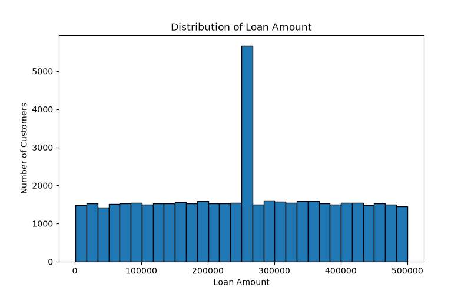
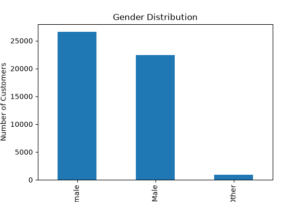
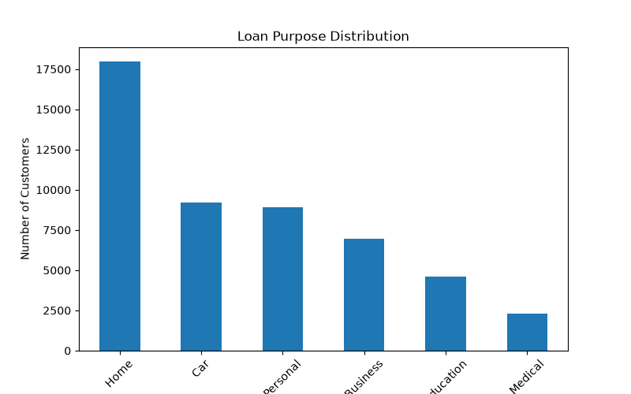
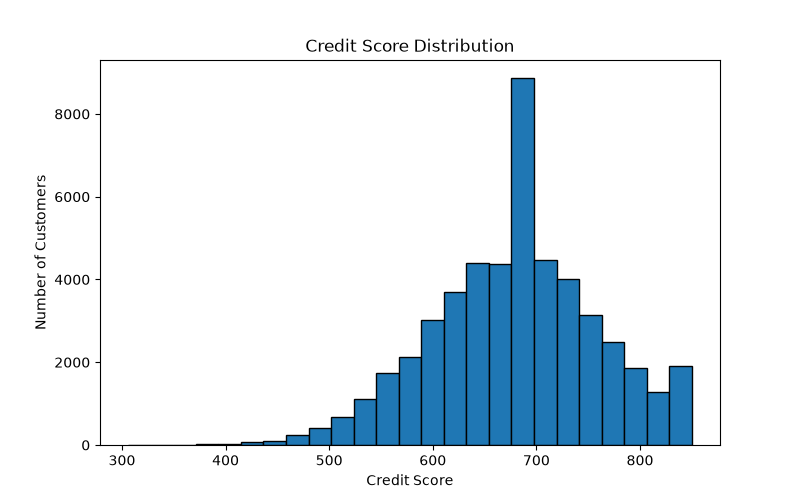
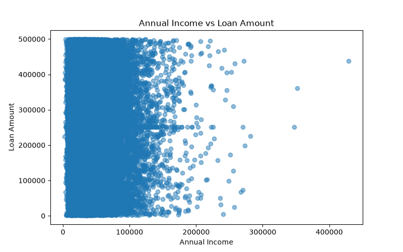
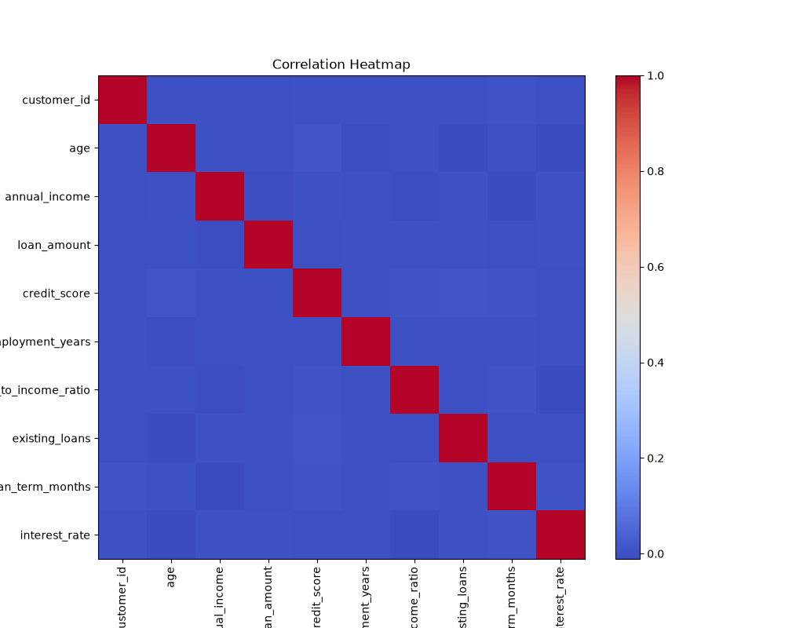

# 📊 Bank Loan Analysis using Python

## 📌 Project Overview

This project analyzes a bank loan dataset using *Python* to understand customer demographics, loan patterns, credit behavior, and relationships between financial variables.

The project includes:
- Data Cleaning
- Exploratory Data Analysis (EDA)
- Business Insights
- Data Visualization

---

## 📂 Dataset Information

- *Rows:* 50,000
- *Columns:* 200
- *Dataset:* Bank Loan Dataset

---

## 🛠️ Technologies Used

- Python
- Pandas
- Matplotlib
- Jupyter Notebook

---

## 📈 Project Workflow

1. Data Loading
2. Data Understanding
3. Data Cleaning
4. Exploratory Data Analysis (EDA)
5. Business Insights
6. Conclusion

---

## 📊 Visualizations

### 1. Loan Amount Distribution

---

### 2. Gender Distribution

---

### 3. Loan Purpose Distribution

---

### 4. Credit Score Distribution

---

### 5. Annual Income vs Loan Amount

---

### 6. Correlation Heatmap

---

## 💡 Key Business Insights

- Loan amounts are distributed across different ranges, with a noticeable spike caused by median value imputation during data cleaning.
- Female applicants represent the largest share of customers in this dataset.
- Home loans are the most common loan purpose among applicants.
- Most customers have moderate to good credit scores.
- Annual income alone is not a strong predictor of loan amount.
- Most numerical variables show weak correlations, indicating loan decisions should consider multiple factors.

---
## 📁 Project Structure

Bank-Loan-Analysis/
│
├── bank_loan_analysis.ipynb
├── README.md
├── requirements.txt
│
└── images/
    ├── loan_amount_distribution.png
    ├── gender_distribution.png
    ├── loan_purpose_distribution.png
    ├── credit_score_distribution.png
    ├── income_vs_loan_amount.png
    └── correlation_heatmap.png
---

## ▶️ How to Run

1. Clone this repository

git clone https://github.com/roshan6969-ui/Bank-Loan-Analysis.git

2. Install dependencies

pip install -r requirements.txt

3. Open

bank_loan_analysis.ipynb

4. Run all notebook cells.

